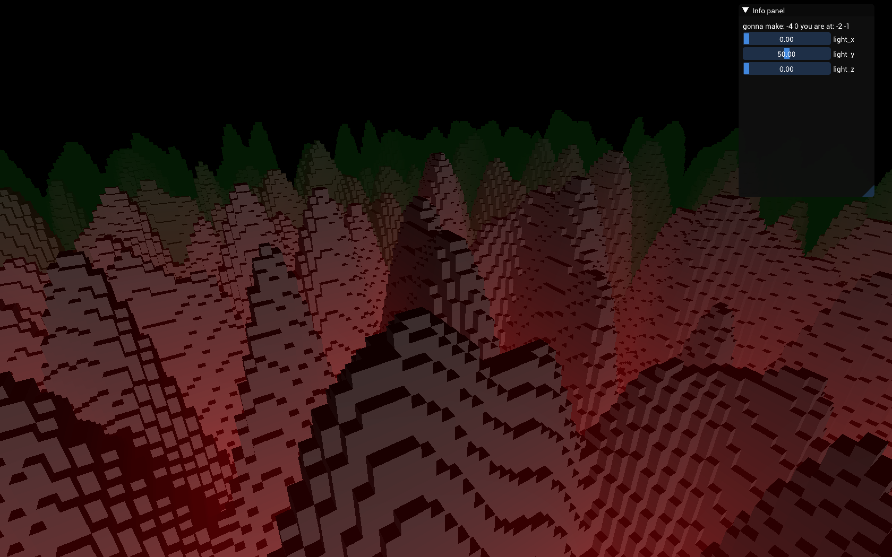

# PyVox
A voxel engine using BGFX render API in Python. Meshing of cubes is done on the GPU by way of compute shader. Simple diffuse lighting and fog is used in rendering. Chunk system uses a not well optimized and rudimentary threading system. Imgui is integrated. Code is largely uncommented, no support will be provided, use as is.

